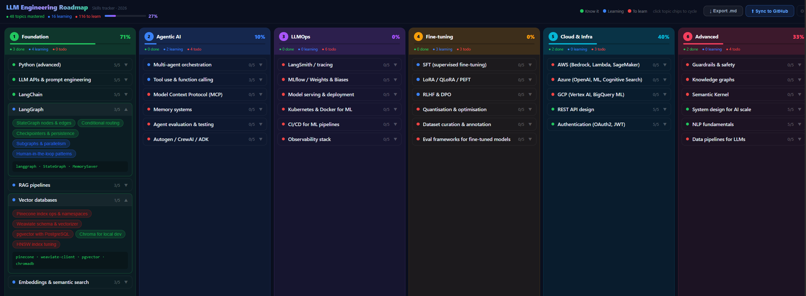

# LLM Engineering Roadmap


A personal, self-hosted learning tracker for LLM engineering skills — deployed to GitHub Pages, with one-click progress sync back to the repo.



---

## Problem

LLM engineering spans a wide, fragmented landscape: RAG pipelines, multi-agent orchestration, fine-tuning, LLMOps, cloud infra, and more. Standard note apps and spreadsheets don't give you a visual, interactive map of where you stand across all of these at once.

The secondary problem: progress lives in your head or a local file. Open a new device and you start from scratch.

## Solution

A dark-mode dashboard organised into **6 tiers** of LLM engineering skill. Every topic chip cycles through three states — **Know it → Learning → To learn** — with a single click. Progress is:

- **Persisted instantly** in `localStorage` (survives refreshes, no backend needed)
- **Synced to the repo** via a single button that triggers a GitHub Actions workflow, updates `src/data.js`, and redeploys GitHub Pages — so any device loading the page cold starts from your last synced state

Public visitors can view the live page and interact locally; only you (PAT holder) can push changes back to the repo.

---

## Architecture

```
Browser
├── src/data.js          ← INIT: default skill states (source of truth in repo)
├── src/App.jsx          ← UI, localStorage persistence, GitHub sync state machine
└── localStorage         ← live per-browser state (overrides INIT on load)

GitHub Actions
├── update-data.yml      ← workflow_dispatch triggered by browser via GitHub API
│                           receives skills JSON → scripts/update_data.py patches
│                           src/data.js → commits using GH_PAT → triggers deploy
└── deploy.yml           ← fires on push to main → npm build → peaceiris/actions-gh-pages

scripts/update_data.py   ← regex-patches {t:"...",s:"..."} status values in data.js
```

### Sync flow

```
Click "Sync to GitHub"
  │
  ├─ POST /actions/workflows/update-data.yml/dispatches  (GitHub API, PAT auth)
  │
  ├─ Poll: update-data workflow → patches data.js → commits → push
  │
  ├─ Poll: deploy workflow → npm build → publishes dist/ to gh-pages branch
  │
  └─ window.location.reload()  ← page now reflects synced defaults
```

---

## Setup

### 1. Fork / clone

```bash
git clone https://github.com/The-Anil/LLMLearningPathTracker.git
cd LLMLearningPathTracker
npm install
```

### 2. Configure repo name

Edit `vite.config.js` — set `base` to match your repo name:

```js
base: '/YourRepoName/',
```

### 3. Create a GitHub Fine-Grained PAT

Go to **GitHub → Settings → Developer settings → Fine-grained tokens → Generate new token**

Scopes needed (this repo only):
- **Actions:** Read & Write
- **Contents:** Read & Write

### 4. Add PAT as repo secret

**Repo → Settings → Secrets and variables → Actions → New repository secret**

Name: `GH_PAT`  Value: your token

### 5. Push to main

```bash
git add .
git commit -m "initial"
git push -u origin main
```

GitHub Actions fires `deploy.yml` automatically.

### 6. Enable GitHub Pages

**Repo → Settings → Pages → Source: `gh-pages` branch → `/ (root)` → Save**

Your tracker is now live at `https://<username>.github.io/<repo>/`

---

## Development

```bash
npm run dev      # local dev server at http://localhost:5173/LLMLearningPathTracker/
npm run build    # production build → dist/
npm run preview  # preview dist/ locally
```

---

## Usage

| Action | How |
|--------|-----|
| Cycle topic status | Click any topic chip |
| Expand / collapse skill | Click the skill row |
| Export mastered skills | **↓ Export .md** button |
| Sync to GitHub | **⬆ Sync to GitHub** → enter PAT on first use |
| Clear saved PAT | **⚙** gear icon (appears after PAT is saved) |

### Topic states

| State | Meaning |
|-------|---------|
| 🟢 Know it | Mastered |
| 🔵 Learning | In progress |
| 🔴 To learn | Not started |

---

## Project structure

```
LLMLearningPathTracker/
├── .github/
│   └── workflows/
│       ├── deploy.yml           # Build + deploy to gh-pages on push to main
│       └── update-data.yml      # workflow_dispatch: patch data.js + commit
├── scripts/
│   └── update_data.py           # Regex-patches topic statuses in src/data.js
├── src/
│   ├── data.js                  # All skill/topic definitions (INIT export)
│   ├── App.jsx                  # Main React component
│   └── main.jsx                 # React entry point
├── index.html
├── vite.config.js
└── package.json
```

---

## License

MIT
